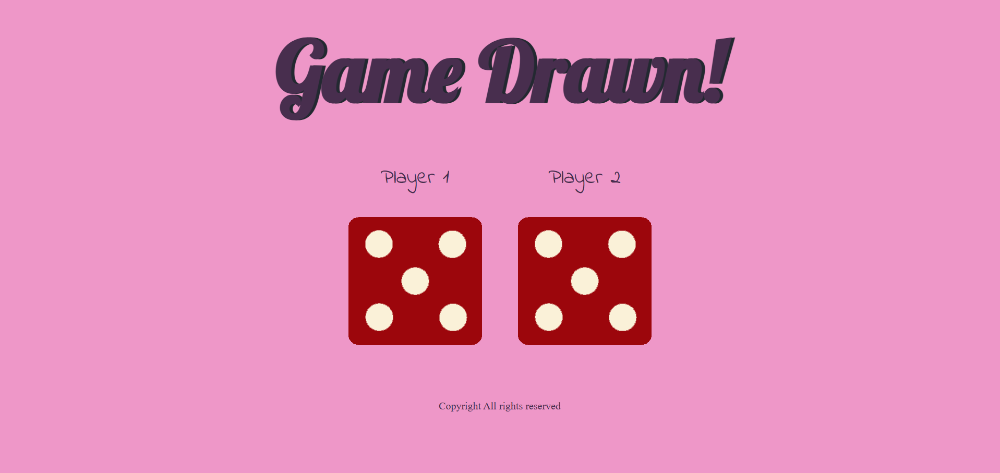
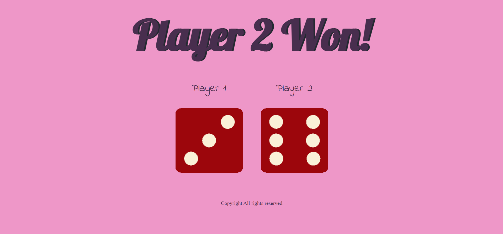
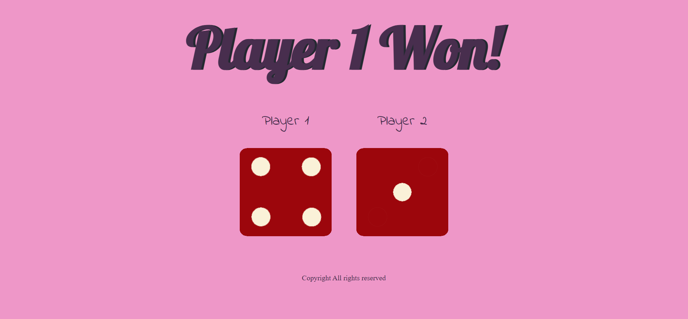

# Dice Game

This repository contains the code for a simple Dice Game built using JavaScript. The game simulates the roll of one or more dice, generating random numbers each time a player "rolls" the dice. The goal is to provide an interactive, fun, and educational project to demonstrate how to use random number generation, DOM manipulation, and basic JavaScript logic.

## Dice Game Screenshot

Here’s a screenshot of the Dice Game in action:

## How to Play:

1. Open the game in a browser.
2. Refresh the website to roll the dice.
3. View the random number on each die.
4. The game can be refreshed to roll the dice again.
